# Meshtastic Monitor

This program was created because I wanted to have a better idea of what was going on in my Meshtastic neighborhood, and I wanted to have a better sense of what happened when I sent / received messages.

It uses the Python API to talk to a local node over HTTP or Serial (although I'm sure you could modify it to work over BLE).

## UI Overview

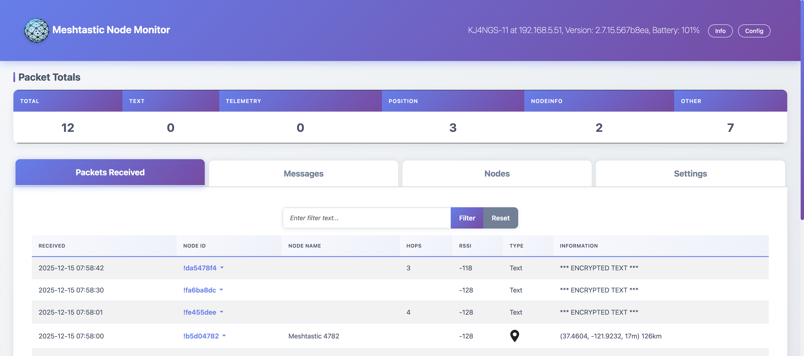

The UI consists of:

* **Navigation Bar**: Shows the node you're connected to, connection type (IP address or serial port), firmware version, and battery level. Two buttons provide quick access to node information:
  * **Info** - Opens detailed information about your local node
  * **Config** - Opens the node configuration interface

* **Packet Totals**: A summary table showing counts of received packets by type (TEXT, TELEMETRY, POSITION, NODEINFO, OTHER)

* **Tabs**: Four main tabs display different views of your mesh network data:
  * Packets Received
  * Messages
  * Nodes
  * Settings

### Packets Received Tab

This tab displays a list of the most recent packets received by the node, not just messages. The tab includes a filter feature that lets you search for packets matching specific text (e.g., find all packets from a certain node).

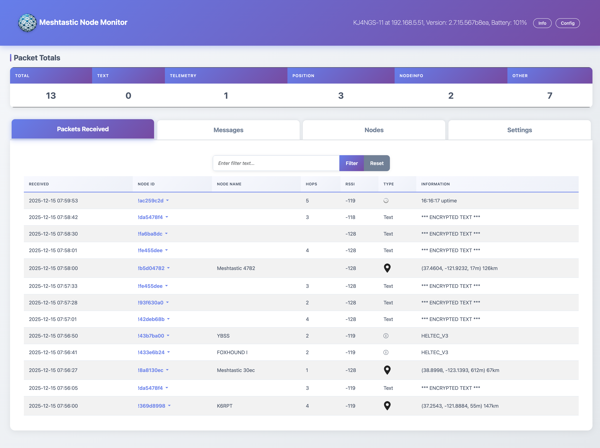

To filter packets, enter text in the filter box and click "Filter". The placeholder will update to show your active filter. Click "Reset" to clear the filter and show all packets again.

#### Node ID Menu

If you click on any Node ID (this works on all tabs where Node IDs are shown), a pop-up menu opens:

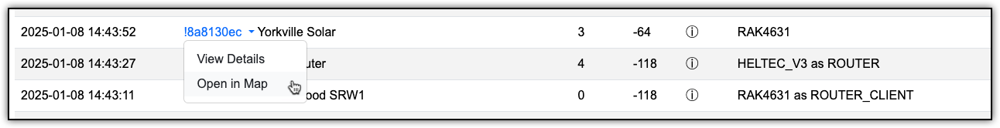

The menu provides four options:

**View Details** opens a modal showing comprehensive information about the node:

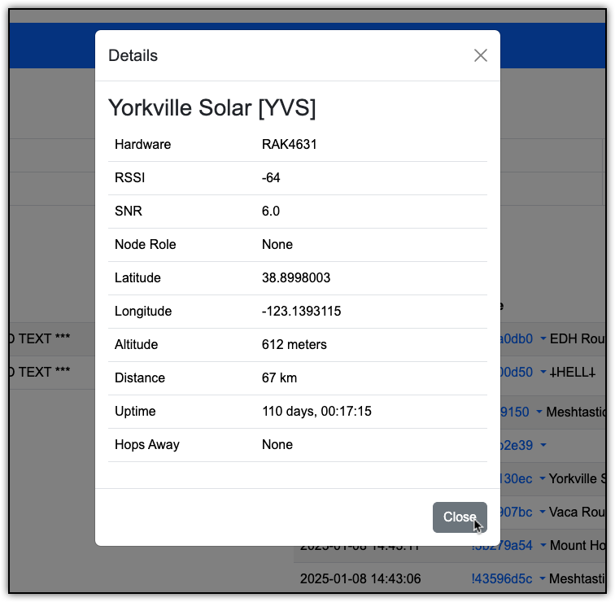

**Open in Map** will open a Meshtastic map (meshtastic.liamcottle.net) in a new tab and focus on the selected node.

**Trace Route** will send a trace route message to the node. If it responds (eventually), you'll see its response in the list of packets received.

**DM Sender** allows you to send a direct message just to that node:

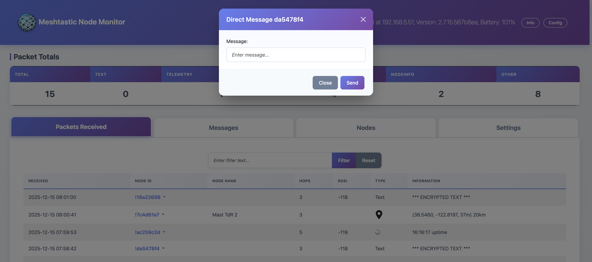

### Messages Tab

The Messages tab logs all text messages received. If messages are encrypted and we cannot decode them, it displays `*** ENCRYPTED TEXT ***`.

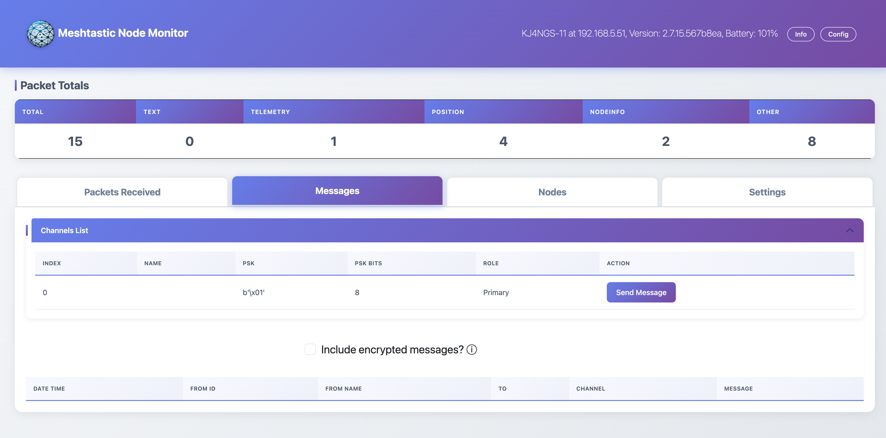

At the top is a collapsible **Channels List** accordion. When expanded, it shows all channels known to your device, along with their encryption settings. Each channel has a **Send Message** button that opens a modal for sending messages to that entire channel:

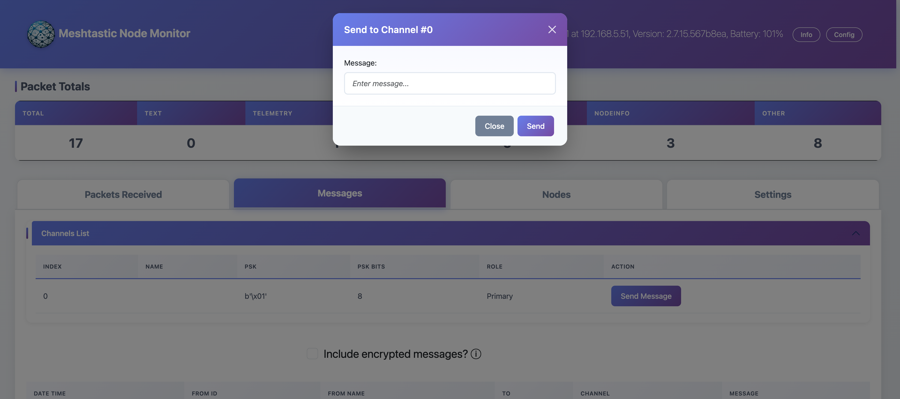

Below the channels list is a checkbox labeled **Include encrypted messages?** When unchecked, encrypted messages will be hidden from the list. This is useful for debugging: if you see an encrypted message appear, you know it was received but you can't decrypt it (likely due to incorrect keys).

Clicking on any From ID in the messages table brings up the same pop-up menu as on the Packets tab, allowing you to view details, open maps, trace routes, or send direct messages.

### Nodes Tab

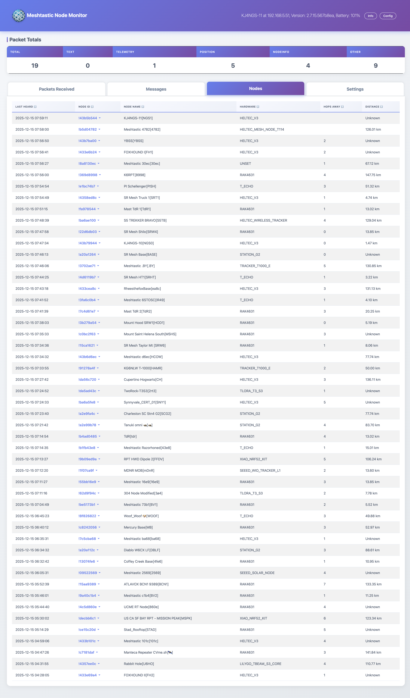

The Nodes tab displays all nodes that your device knows about, initially sorted by last heard (most recent first).

**Sortable Columns**: Click any column header to sort by that column. The sort indicator (↕️ ↑ ↓) shows the current sort state. Click again to reverse the sort order. The table will maintain your sort preference as new data arrives.

Clicking on any node ID opens the same menu for viewing details, opening maps, trace routes, and sending direct messages.

### Settings Tab

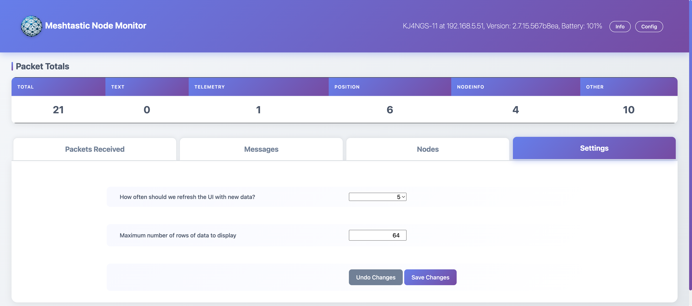

Settings allows you to control:

* **Refresh Interval**: How often (in seconds) the browser polls the server for new data
* **Maximum Rows**: How many rows of data to display in each tab (note: this is separate from how many rows the server keeps in memory)

Click **Save Changes** to apply your settings, or **Undo Changes** to revert to the previous values.

### Local Node Information

Click the **Info** button in the navigation bar to view detailed information about your local node:

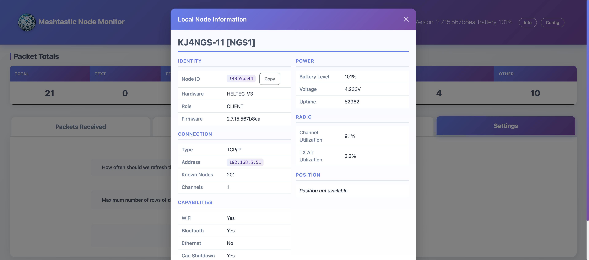

This modal displays:
* **Identity**: Node ID (with copy button), hardware model, role, and firmware version
* **Connection**: Connection type, address, number of known nodes, and channel count
* **Capabilities**: WiFi, Bluetooth, Ethernet availability, and shutdown capability
* **Power**: Battery level, voltage, and uptime
* **Radio**: Channel utilization and TX air utilization statistics
* **Position**: GPS coordinates if available

### Node Configuration

Click the **Config** button in the navigation bar to access the node configuration interface:

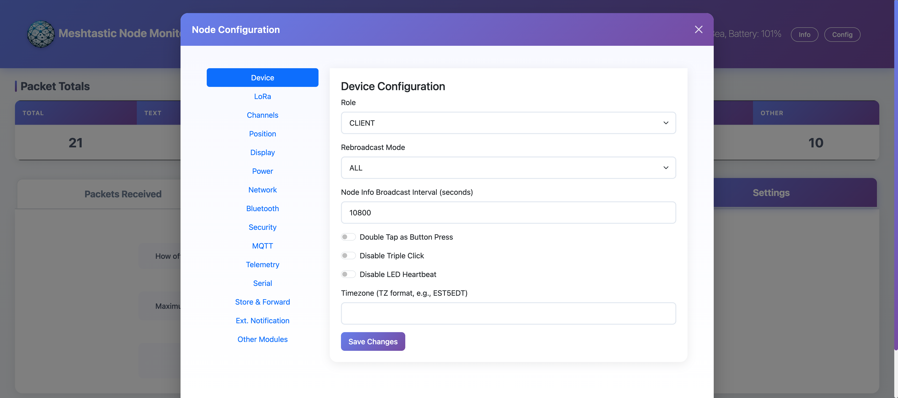

This powerful interface provides tabbed access to all node settings:
* Device, LoRa, Channels, Position
* Display, Power, Network, Bluetooth
* Security, MQTT, Telemetry, Serial
* Store & Forward, Ext. Notification, Other Modules

Changes made here are sent directly to your node. Use caution when modifying settings.

### Notifications


The application uses toast notifications (small pop-up messages in the top-right corner) to provide feedback on actions like sending messages, trace routes, or when operations succeed or fail. These automatically disappear after a few seconds.

## Setting Up

Create a virtual environment for the project:

```sh
python -m venv .venv
source .venv/bin/activate
```

(On Windows, something like that, I presume)

Install the required packages:

```sh
pip install -r requirements.txt
```

Before you can run the application, you need to edit sample-config.toml and rename it to config.toml. It looks like:

```toml
#
#   Edit this file to suit your needs and copy/rename to config.toml
#
# Used for distance calculations
[location]
my_latitude     =   40.12345        # As much precision as you like, but remember that Meshtastic reporting will
my_longitude    = -120.12345        # typically futz your position unless you tell it to be precise.

# Data Management in Application
[data]
append_log      = true              # Do we append to packetlog.txt on start, or create a new one?
persist_data    = true              # Save messages / packets between sessions?
max_packets     = 1024              # Maximum number of rows of packets we keep on the server (vs. displayed to user)?
max_messages    = 1024              # Maximum number of rows of messages we keep (vs. displayed to user)?

# Control debugging features
[debug]
http_logging    = false             # Do we want to see HTTP logs for every call from the app?
```

Be sure to update the lat/long.

## Running

To run the app:

* For connection over WiFi: `python mesher.py ip-address-of-node`
* For connection over Serial: `python mesher.py /dev/...`

There are default connections in mesh.py if you don't provide an ip-address or serial device.

It will open a browser window to the app on its own.

There's a shell script, start.sh, that activates the virtual environment and runs the app.

## Notes of Interest

1. The program creates a file `packetlog.txt` with all the packets it receives during the run. It's useful for debugging. Unlike the display, which is limited to a maximum number of records, the file grows endlessly as the program is run. It will be zeroed out when you restart the program, unless you set `append_log` to `true` in config.toml.

2. If you have `persist_data` set to `true` in config.toml, it creates a file `persisted_data.pkl` that holds the data from packets, messages, and counts so that when you restart the program it picks up where it left off. (Node data is persisted in the device itself, so we do not need to replicate it.)

3. When the computer sleeps, the program gets disconnected. Just restart it.

4. There are times when Chrome says "Aw Snap!". Not sure why, but just refresh the page and nothing is lost. Safari does not have this problem. It's strange.

**Final Note:**

I wrote this program so I could understand what the nodes were doing. I started from knowing nothing, and there may well be some ignorance that persists in the program. Probably a lot. Feel free to fix anything you don't like :-).
