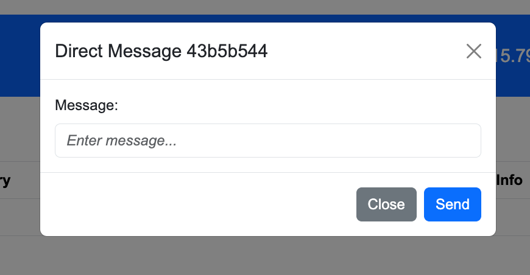
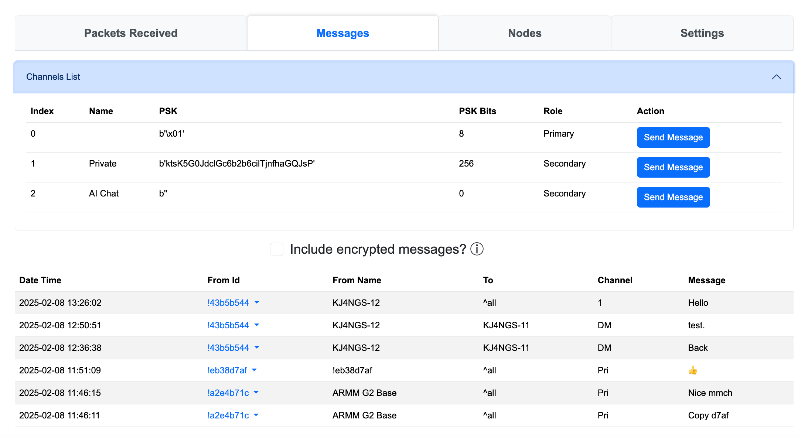

# Meshtastic Monitor

This program was created because I wanted to have a better idea of what was going on in my Meshtastic neighgorhood, and I wanted to have a better sense of what happened when I sent / received messages.

It uses the Python API to talk to a local node over HTTP or Serial (although I'm sure you could modify it to work over BLE).

## UI

The UI consists of:

* A header bar that tells you what node you're connected to, how you're connected to it, and power stats.  Note that the power stats are not updated after the program starts.

* Counts at the top of packets received
* A set of tabs that display various types of data: Packets Received, Messages, Nodes, and Settings


### Packets Received Tab

This tab displays a list of the most recent packets received by the node, not just messages.  You can filter the list to only show packets that match a certain string so, for example, you can find packets from a certain node.


I

f you click on the Node Id, a pop-up menu opens (this works on any tab a Node Id is shown):


View Details opens a pop-up:


Open in Map will open a Meshtastic map in a new tab and focus on the node in question.

Trace Route will send a trace route message to the node.  If it responds (eventually), you'll see its response in the list of packets received.

The Send DM choice will allow you to send a message just to that node:




### Messages

The Messages tab logs all text messages received; if they are encrypted and we cannot decode them, it simply says `*** ENCRYPTED TEXT ***`.



At the top is a collapsible section labeld "Channels List", which you can expand or contract to show the channels known to your device.  The "Send Message" button can be used to send a message to the entire channel.

If `Include encrypted messages?` is unchecked, encrypted messages will not be shown in the list.  You might want to see encrypted messages to help you debug why a private channel isn't working: did you get the message at all vs. you can't decrypt it (because you don't have the keys correct).

If you click on From Id, you get the same pop-up menu as on the packets received tab.

### Nodes


The nodes tab displays the nodes that the device knows about, sorted by last heard from most to least recent.  As before, clicking on the node id pops-up the menu for displaying more information, showing the node on a map, or sending a trace route to it.

### Settings

Settings allows you to control:

* How often the browser polls the server for messages and how many rows to display.
* How many rows of data to show in the UI (vs how many are on the server)


## Setting Up

Create a virtual environment for the project:

```sh
python -m venv .venv
source .venv/bin/activate
```

(On Windows, something like that, I presume)


Install the required packages:

```sh
pip install -r requirements.txt
```


Before you can run the application, you need to edit sample-config.toml and rename it to config.toml.  It looks like:

```toml
#
#   Edit this file to suit your needs and copy/rename to config.toml
#
# Used for distance calculations
[location]
my_latitude     =   40.12345        # As much precision as you like, but remember that Meshtastic reporting will
my_longitude    = -120.12345        # typicaly futz your position unless you tell it to be precise.

# Data Management in Application
[data]
append_log      = true              # Do we append to packetlog.txt on start, or create a new one?
persist_data    = true              # Save mesages / packets between sessions?
max_packets     = 1024              # Maximum number of rows of packets we keep on the server (vs. displayed to user)?
max_messages    = 1024              # Maximum number of rows of messages we keep (vs. displayed to user)?

# Control debugging features
[debug]
http_logging    = false             # Do we want to see HTTP logs for every call from the app?
```

Be sure to update the lat/long.


## Running


To run the app:

* For connection over WiFi: `python mesher.py ip-address-of-node`
* For connection over Serial: `python mesher.py /dev/...`

There are default connections in mesh.py if you don't provide an ip-address or serial device.

It will open a browser window to the app on its own.

There's a shell script, start.sh, that activates the virtual environment and runs the app.


## Notes of Interest


1. The program creates a file packetlog.txt with all the packets it receives during the run.  It's useful for debugging.  Unlike the display, which is limited to a maximum number of records, the file grows endlessly as the program is run.  It will be zeroed out when you restart the program, unless you set the environment variable `append_log` to `true`
2. If you have `persist_data` set to `true`, it creates a file `persisted_data.pkl` that holds the data from packets, messages, and counts so that when you restart the program it picks up where it left off.  (Node data is persisted in the device itself, so we do not need to replicate it.)
3. When the computer sleeps, the program gets lost.  Just restart it.
4. There are times when Chrome says "Aw Snap!".  Not sure why, but just refresh the page and nothing is lost.  Safari does not have this problem.  It's strange.


**Final Node:**

I wrote this program so I could understand what the nodes were doing.  I started from knowing nothing, and there may well be some ignorance that persists in the program. Probably a lot.  Feel free to fix anything you don't like :-).

